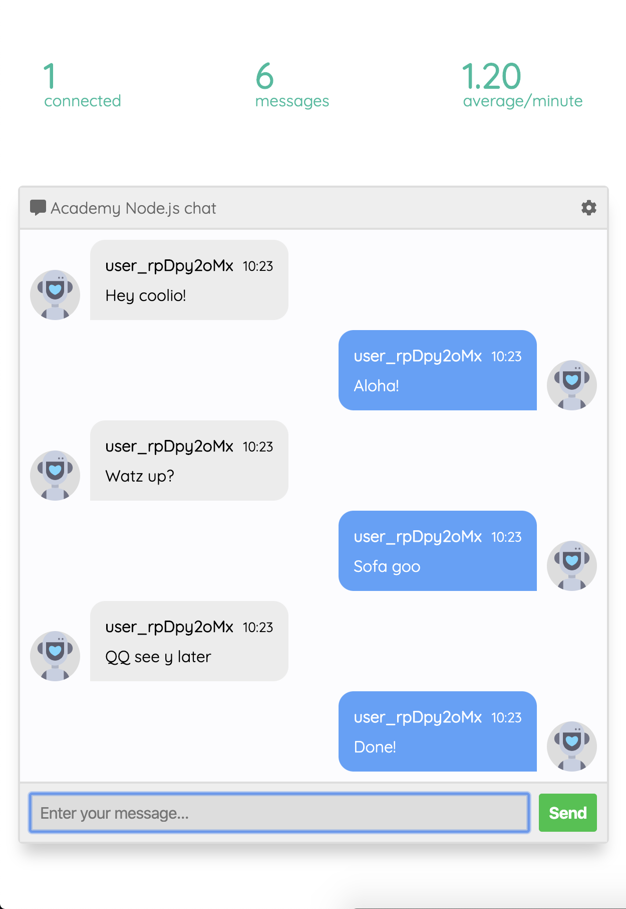

# Agile Actors Academy

Welcome to Node.js Workshop!

## Introduction

In this workshop we will introduce the core concepts of Node.js and how you can use them to develop a modern node application.

## What we will build

We are going to build a chat app using Node and a real time board for chat analytics. We have split the steps in several branches with each branch has its own tasks which you have to complete in order to proceed to the next branch.

<div style="width: 100%; display: flex; justifyContent: space-between">
  <div style="margin-right: 5px">
    
  </div>
  <div>
 
  </div>
</div>

### Available Branches

1. node--01--repl
2. node--02--fs-sync
3. node--03--fs-async
4. node--04--fs-globals
5. node--05--modules
6. node--06--http
7. node--07--http-handlers
8. node--08--http-middleware
9. node--09--socket-io
10.node--10--child-process

## Getting started

### ✔ 1 Install Node.JS LTS

Install Node.JS LTS from [nodejs official site](https://nodejs.org/en/download/)

### ✔ 2 Ensure Node and npm are installed correctly

Ensure node.js is installed by running the following command in a terminal, similar with npm.

Run the commands:

```
node -v
```

```
npm -v
```

### ✔ 3 Clone this repo

Run the command:

```
git clone https://github.com/agileactors/academy-node-workshop/
```

_If you do not have git install follow this link [How to install Git](https://git-scm.com/book/en/v2/Getting-Started-Installing-Git) to install it_

Then navigate into the project directory and install all depedencies:

```
cd academy-node-workshop
```

using npm

```
    npm install
```

using yarn

```
    yarn
```

Run the application using the command in a terminal:

```
    npm start or yarn start
```

You can preview the application using the following url: <a href="http://localhost:8001/chat" target="_blank">http://localhost:8001/chat</a>
